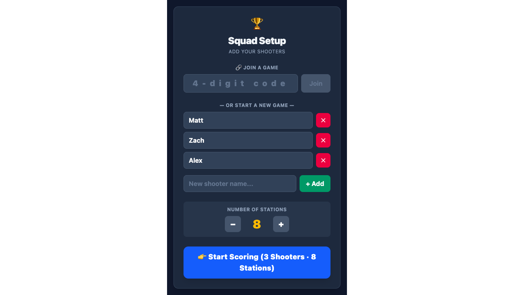
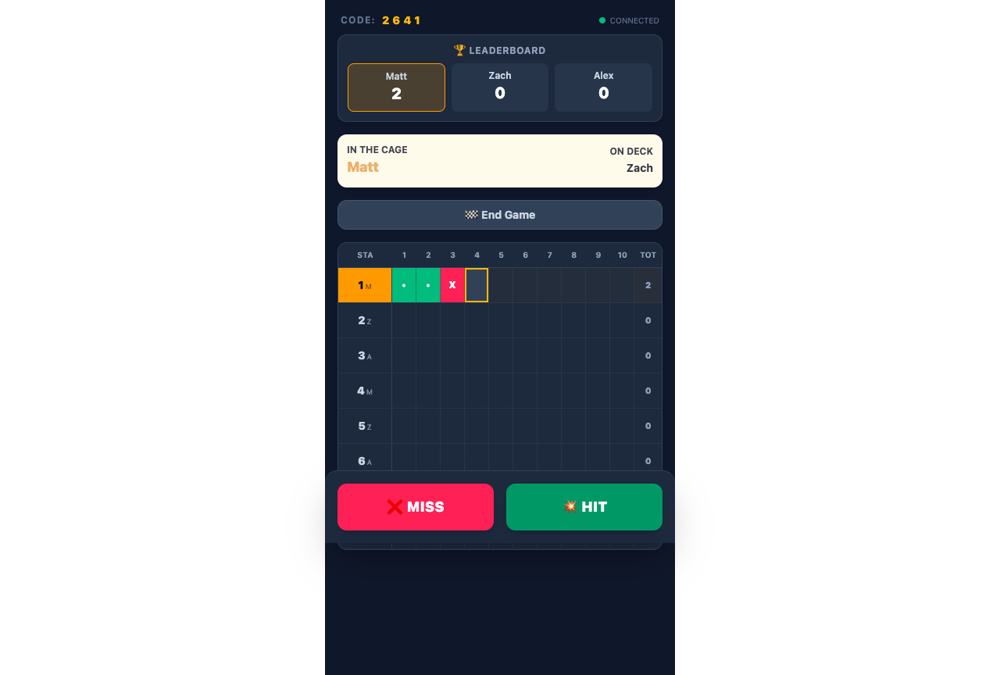
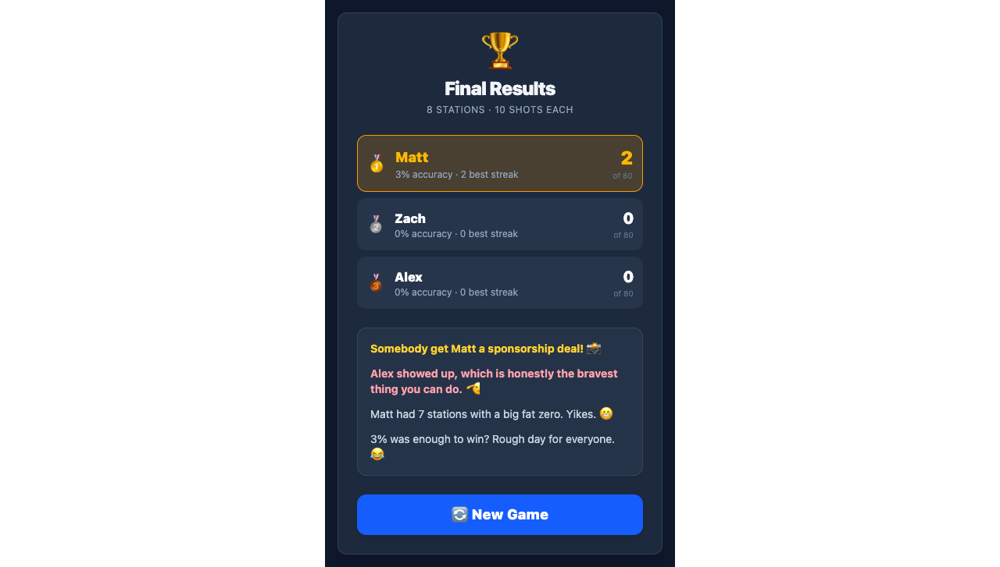

# 🏆 Claymate

A real-time multiplayer sporting clays scorecard app. Set up your squad, shoot your rounds, and see live scores sync across multiple phones — perfect for the range.



## Features

- **Real-time multiplayer** — Multiple phones sync live via Supabase Realtime. Everyone sees scores update instantly.
- **4-digit join codes** — Host starts a game, players join by entering a short code. No signups, no hassle.
- **Auto-rotating shooter order** — Automatically rotates through your squad per station so everyone gets their turns.
- **Hit/Miss scoring** — Simple tap-to-score interface: green for hit, red for miss. That's it.
- **Live leaderboard** — Running totals always visible so you know who's winning.
- **Game summary** — Final rankings, accuracy percentages, best streaks, and trash-talking quips at the end.
- **Works offline** — Falls back to local scoring if the network drops, syncs when reconnected.



## How It Works

1. **Host** opens the app, adds shooter names, picks station count, and taps *Start Scoring*
2. **Players** join by entering the 4-digit code on their own phone
3. Everyone scores in real-time — see who's in the cage, who's on deck, and the live leaderboard
4. Tap *End Game* to see final results with rankings and quips



## Tech Stack

- **Frontend:** React + Vite + Tailwind CSS
- **Backend / Realtime:** [Supabase](https://supabase.com) (PostgreSQL + Realtime subscriptions)
- **Hosting:** [Netlify](https://netlify.app)

## Development

```bash
# Install dependencies
npm install

# Start dev server
npm run dev

# Build for production
npm run build
```

### Environment Variables

Create a `.env` file with your Supabase project credentials:

```env
VITE_SUPABASE_URL=https://your-project.supabase.co
VITE_SUPABASE_ANON_KEY=your-anon-key
```

You can get these from your [Supabase project settings](https://app.supabase.com) → Settings → API.

## Database Schema

The app uses a single `games` table:

| Column | Type | Description |
|--------|------|-------------|
| `id` | UUID | Primary key |
| `game_code` | TEXT | 4-digit join code |
| `game_name` | TEXT | Auto-generated fun name |
| `squad` | JSONB | Array of player names |
| `num_stations` | INT | Number of stations (1-12) |
| `scores` | JSONB | Nested array: player → station → shots |
| `active_station` | INT | Current station being shot |
| `active_shooter` | TEXT | Current shooter's name |
| `active_shot_index` | INT | Current shot number |
| `status` | TEXT | `active` or `ended` |
| `created_at` | TIMESTAMPTZ | Creation timestamp |

Enable **Realtime** on the `games` table in your Supabase Dashboard for live sync.

## License

MIT
